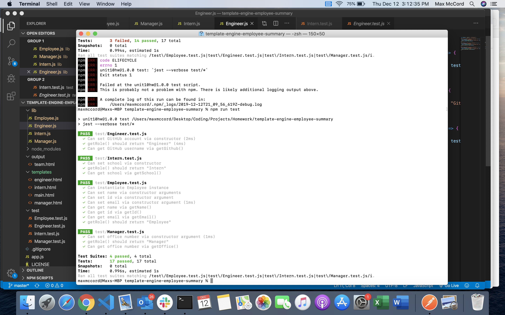

# template-engine-employee-summary
Build a software engineering team generator command line application. The application will prompt the user for information about the team manager and then information about the team members.  When the user has completed building the team, the application will create an HTML file that displays a nicely formatted team roster based on the information provided by the user.

This homework has been extremely rough - I have started and stopped several times seeminly without direction.

I have added a screenshot of the tests passing after creating the proper classes for each type of Employee.

##Image
here are the tests that pass in the terminal

##Usage
this app is designed to provide practice for using Classes and passing functions to one another - I will need to study this much further